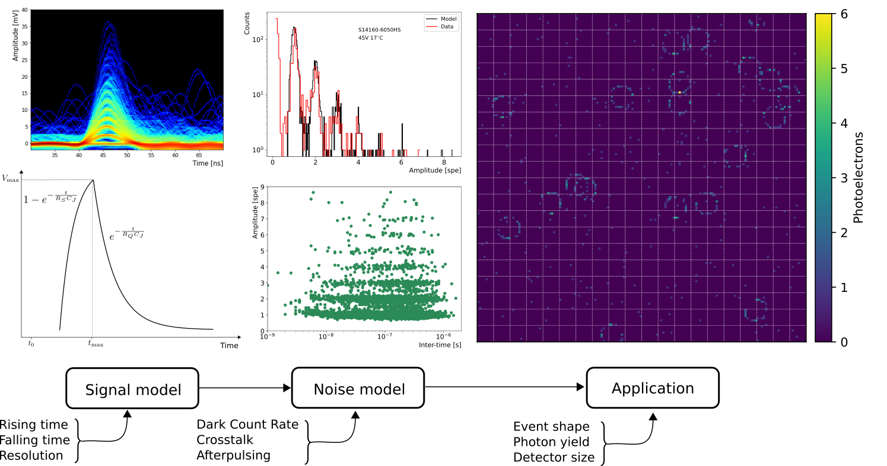

# SiPM-APD-MPPC
Simulation framework for testing Silicon Photo-Multipliers and Multi-Pixel Photon Counters. This python module allows users to performe noise analysis of SiPM/MPPCs: Dark Count Rate, Afterpulsing, and Crosstalk. Futhermore, the SiPM/MPPC module is capable to set SiPM arrays (MPPC) for large areas like Ring Imaging Cherenkov detectors, Cherenkov Telescopes, etc. Users can simulate ring or shower shape signals based on the expected number of photons generated by the source.

Author: Dr. Jesús Peña Rodríguez\
Experiment: Compressed Baryonic Matter (CBM)\
Bergische Universität Wuppertal\
May, 2024




## Using the SiPM-APD-MPPC module 

The simulation framework is able to generate a single SiPM pulse or pulses generated along a recording window for one or multiple SiPMs. The user also can create analysis plots as peak spectrum histograms, amplitude vs. relative time scatter plots, relative time histograms, and DCR vs. threshold curves.

The scripts **RiCH_example.ipynb** and **IACT_example.ipynb** show application examples of Ring Imaging Cherenkov detectors (RICH) and  Imaging Atmospheric Cherenkov Telescopes (IACT) respectively. Below, you find a general example of the SiPM python module.

### Signal generation

Single SiPM signal.

```python

# Importing the simulation module

import SiPM_MPPC.sipm as sipm
import matplotlib.pylab as plt
import numpy as np

# Creating a single sipm pulse
# Input parameters

Rt = 2e-9 # Rising time in seconds 
Ft = 50e-9   # Falling time in seconds
A = 1 # Pulse amplitude (pe) photo-electron
R = 0.5 # Time step in ns

pulse = sipm.Pulse(Rt, Ft, A, R, plot=True)
# Output
# pulse, sipm pulse shape with time step R

```

SiPM signal during a recording window.

```python

# Simulating a sipm signal during a recording window
# Input parameters

DCR = 159.6e3  # Dark count rate in Hz/mm2
p_size = 36.0 # SiPM size mm2
CT = 0.31 # Crosstalk normalized to 1
AP = 0.01 # Afterpulse normalized to 1
T_rec = 55e-9 # Recovery time in ns
T_AP = 14.8e-9 # Trapp releasing time in ns
sigma = 0.1 # Amplitude variance in pe
W = 1000  # Recording window in ns
Np = 1 # Number of SiPM

signal, time = sipm.MPPC(pulse, Np, DCR, p_size, CT, AP, T_rec, T_AP, W, R, sigma)
# Output
# signal, sipm signal amplitude in pe
# time, sipm signal time in ns

```

### Analysis

Peak spectrum and relative time (between consecutive pulses) distribution.

```python

# Generating the peak spectrum and inter-time distributions

A, I, X, Y = sipm.Amplitude_Intertime(signal, N_p, W, R, plot=True)
# Output
# A, amplitude vector in pe
# I, time difference between consecutive pulses in s
# X, peak spectrum x-axis
# Y, peak spectrum y-axis

```

Dark-Count-Rate vs. threshold

```python

# Generating the DCR vs. threshold curve
# Input parameters

Lt = 0.1 # Lower threshold in pe
Ut = 8 # Upper threshold in pe
Pt = 200 # Threshold evaluation points

Th, Noise = sipm.DCR_threshold(signal, W, R, Lt, Ut, Pt, plot=True)
# Output
# Th, threshold vector in pe
# Noise, noise frequency in Hz

```
