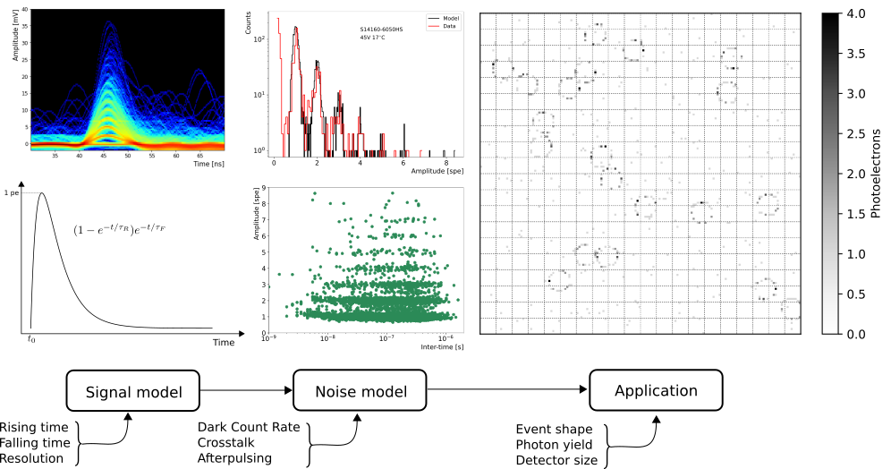

# SiPM-APD-MPPC
Simulation framework for testing Silicon Photo-Multipliers and Multi-Pixel Photon Counters. This python module allows users to performe noise analysis of SiPM/MPPCs: Dark Count Rate, Afterpulsing, and Crosstalk. Futhermore, the SiPM/MPPC module is capable to set SiPM arrays (MPPC) for large areas like Ring Imaging Cherenkov detectors, Cherenkov Telescopes, etc. Users can simulate ring or shower shape signals based on the expected number of photons generated by the source.

Author: Dr. Jesús Peña Rodríguez\
Experiment: Compressed Baryonic Matter (CBM)\
Bergische Universität Wuppertal\
May, 2024




## Example 

```python

# Importing the simulation module

import SiPM_MPPC.sipm as sipm
import matplotlib.pylab as plt
import numpy as np

# Creating a single sipm pulse
# Input parameters

Rt = 2e-9 # Rising time in seconds 
Ft = 50e-9   # Falling time in seconds
A = 1 # Pulse amplitude (pe) photo-electron
R = 0.5 # Time step in ns

pulse = sipm.Pulse(Rt, Ft, A, R, plot=True)
# Output
# pulse, sipm pulse shape with time step R

```
